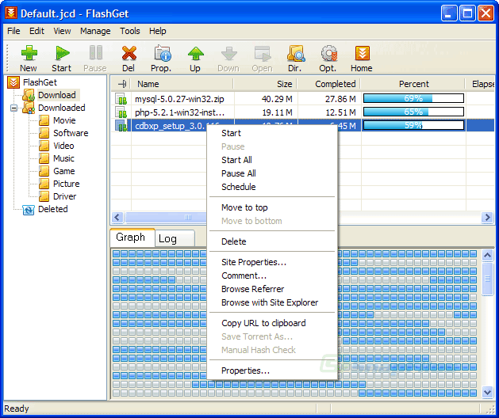

[No-Intro](https://no-intro.org/) 和 [Redump](http://redump.org/) 是两个由互联网上的游戏爱好者们维护的数据库，目标是获取并保存过去那些通过卡带和碟片发行的老游戏的特征码。

早期的卡带游戏，由于破解和盗版横行，玩家能够玩到的版本往往已经被修改过。比如你很可能就玩过一个叫做「90 坦克」的游戏，实际上是修改自 NAMCO 的一个叫做 BattleCity 的 Famicom 游戏。而在游戏的开头，往往就会有修改者加上的新的画面，也就是 intro。而 No-Intro 项目就是希望能够维护这样的一个数据库——里面是这些游戏的原始版本的特征码，也就是 hash 值。hash 是一类计算机算法，通过复杂的数学过程，可以获得一个文件的特征。如果两个文件的内容的每一个字节都是相同的，那么就会获得同样的 hash 值。常见的 hash 算法有 MD5，SHA1，SHA256 等等。

IPFS 的 Content-addressing，也就是「内容寻址」技术，也是基于 hash。只是你[不能直接在 IPFS 中使用一个文件的 SHA256 值来找到它](https://discuss.ipfs.tech/t/receive-a-file-with-an-known-sha256-sum-from-ipfs/7122)，而需要通过 IPFS 的 CID。IPFS 的 CID 包括了比整个文件的 hash 更多的信息。

所以，假如像 No-Intro 这样的数据库中除了 SHA-256，同时也包括文件的 CID 值的话，那么就有可能可以通过整个互联网，而不是某台确定的服务器，来获得那个文件了。只是这种不确定性，同时带来了很多的优点和缺点。

优点：

- 不需要依赖单一的网站地址或者服务器地址：互联网上的大部分地址都无法存在太长时间，[平均值甚至不到半年](https://blogs.loc.gov/thesignal/2011/11/the-average-lifespan-of-a-webpage/)。而 SHA256 或者 CID 是确定的，因此假设如果互联网上确实有 IPFS 服务器存储了某个确定的 CID，那就有机会下载下来。

缺点：

- 巨大的 overhead。如果你曾经看过 Jeff Dean 的 [Latency Numbers Every Programmer Should Know](https://gist.github.com/jboner/2841832)，然后再看 IPFS 内容寻址的过程，就会看到一切都完全发生在一个不确定的网络架构中，因此需要非常多次尝试才有可能拿到有意义的数据，这是巨大的 overhead。

基于内容寻址的技术因为其不需要依赖特定服务器，谁都可以存，因此在理想情况下，如果一个内容确实有很多节点都存了，于是也就实现高度的去中心化。所以在一些理解和需要这样架构的场景中已经得到了应用，比如 NFT 的图片。当你在 mint 一个 NFT 时，大部分情况下，你获得的 token 并不是图片文件本身，而是图片文件的 CID。理想情况下，NFT 的 CID 会有多个 IPFS 节点存储，因此通过 CID 就始终可以获得这张图片。为什么一直强调「理想情况」，因为另外一种情况是，随着时间过去，一件事情没有人在意了，于是本来存有这些 CID 的服务器逐个下线了，最终这个 CID 也就消失了。就像，如果，即使我们知道一个 ROM 的 SHA-256 值，但这个世界上最后一块存有那个 ROM 的硬盘坏了，并且原始的最后一张游戏卡带也坏了的话，那么即使知道 SHA-256 值，那个文件也会永远消失。如果要增加一个文件持续存在下去的可能性，那么尝试多种完全不同的存储和传播方式就是有意义的。

前面提到 IPFS 的内容寻址过程中的不确定性，这或许是一个可能可以解决的用户体验问题。相比通过商业 CDN 加速过的内容，从 IPFS 网络下载东西的体验可能会非常糟糕——因为很多时候如果试着直接在浏览器里访问一个 CID，就卡在那里了，像是什么都没有发生。

早期的拨号互联网，及 BitTorrent 下载也面临同样的用户期待值问题，于是开发者们通过更好的进度条来实现了用户体验优化。

而这样的图形化手段，应该也可以用于改进 IPFS CID 的下载体验。但目前（2024 年 7 月），这样的软件存在于传统的 HTTP 协议和 BT 协议，暂时还没有看到针对 CID 下载的实现。

想象这样的一种可能性：各种下载网站上提供的不只是 https 或者 torrent，也提供或者只提供 CID。下载一个文件的过程是把 CID 放进原生支持 IPFS 通讯协议的下载软件，然后下载软件就可以显示一个非常具体的进度，甚至可以通过多线程同时下载文件的不同部分。对于下载网站的维护者来说，文件存储除了完全自己维护，也有可能通过更多的其他人的服务器来分档存储。而对于各种 retro 内容存档爱好者们来说，自己在意的内容，也多了一种获得和持续存在下去的可能。