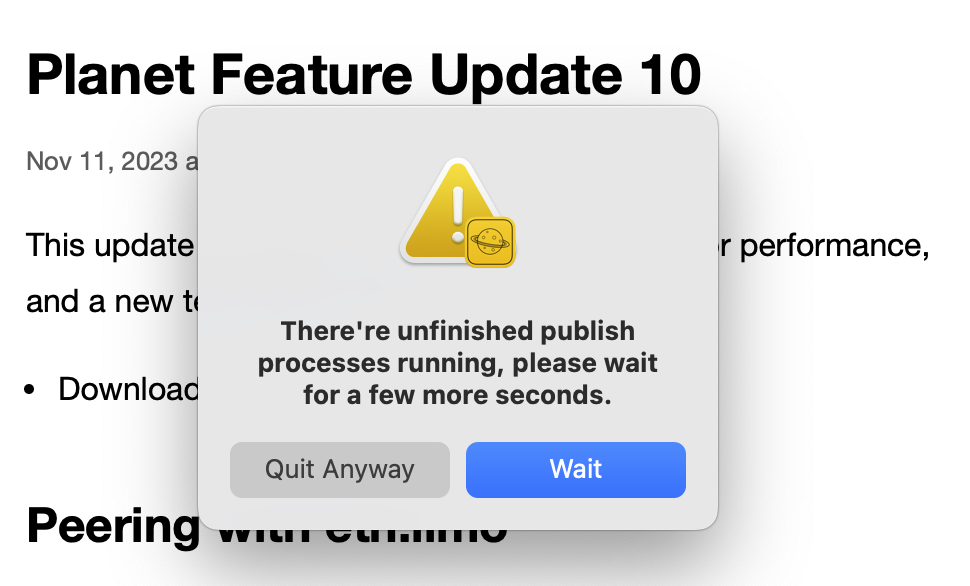

这次的更新里包括了一些重要的性能方面的改进，及一个全新的主题：Sepia！

## 与 eth.limo 的直连（IPFS Peering）

[eth.limo](https://eth.limo) 是目前最好的 ENS 网站网关。IPFS 直连（Peering）功能的加入，意味着你接下来更新的任何新内容，都可以更顺畅地出现在 eth.limo 上。因为现在 eth.limo 在 IPFS 网络上可以直接找到你的节点。

关于这项技术的更多细节，如果你好奇，可以阅读 IPFS 官方关于 Peering 的文档：

https://docs.ipfs.tech/how-to/peering-with-content-providers/

## 新主题 Sepia

Sepia 是一个全新设计的主题，非常适合更新频繁的 microblog 类型内容。

点击 [这里](https://gateway.v2ex.pro/ipns/k51qzi5uqu5dgpbgbc7c3w2wjpsyqb28l5205znvbegmn5p7koctjuvgxb56r1/) 可以看到使用这个主题的一个演示网站。

功能列表：

- 按时间顺序在首页展示每一个发帖的完整内容（类似 Twitter/X 的展示逻辑）
- 当使用桌面浏览器访问时，呈现的是两栏结构，同时针对移动设备做了响应式设计适配
- 支持视频、音频、及多图内容
- 支持 Planet 最新的标签和归档功能

我们会继续改进围绕这个新主题的发帖功能。期待能够收到来自大家的反馈。在下一次的更新中，我们会加入一个全新的发帖界面，让更频繁的内容更新过程变得更加舒服。😌

## 改进了的 IPNS 发布流程

当你尝试在应用程序正在执行 IPNS 发布（侧边栏中有动画沙漏图标时）时退出应用程序，现在会显示一个确认对话框。以前，在此过程中退出应用程序可能导致 IPNS 发布未完成，并导致网站无法解析。

我们相信这个改进会大幅改善 IPNS 网站因为发布中断而导致的无法解析问题。

## 改进了的 Rebuild

现在有两种类型的 Rebuild：Quick Rebuild 和 Full Rebuild。Quick Rebuild 只会重新生成站点的首页文件，即 `index.html`。Full Rebuild 还会使用您当前为站点选择的模板重新生成每篇帖子。当你正在调试如 [Croptop](https://croptop.eth.limo) 这样的 SPA（单页应用程序）模板时，Quick Rebuild 会非常有用。

## 其他修复和改进

- 修复了在 macOS 14 上添加附件功能无法使用的问题
- 修复了导致侧栏站点头像模糊的图像插值设置
- 修复了当头像取消设置时，网站 favicon 未被移除的问题
- 增加了在快速分享对话框中粘贴图片的支持
- 为 Planet API 服务增加了 Bonjour 宣告
- 在头像选择器中增加了随机选择功能
- 增加了一个新的 API 端点：`/v0/id`