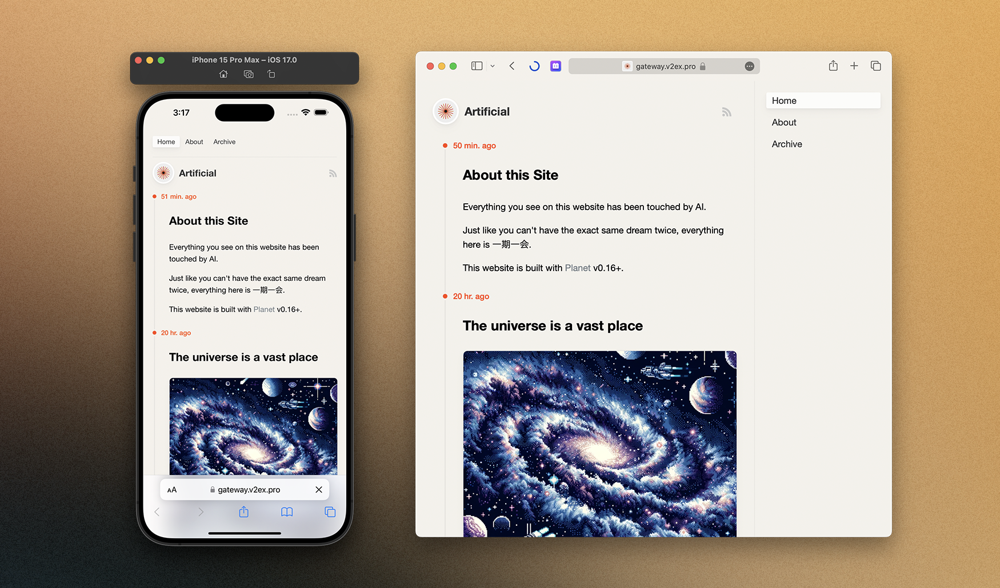
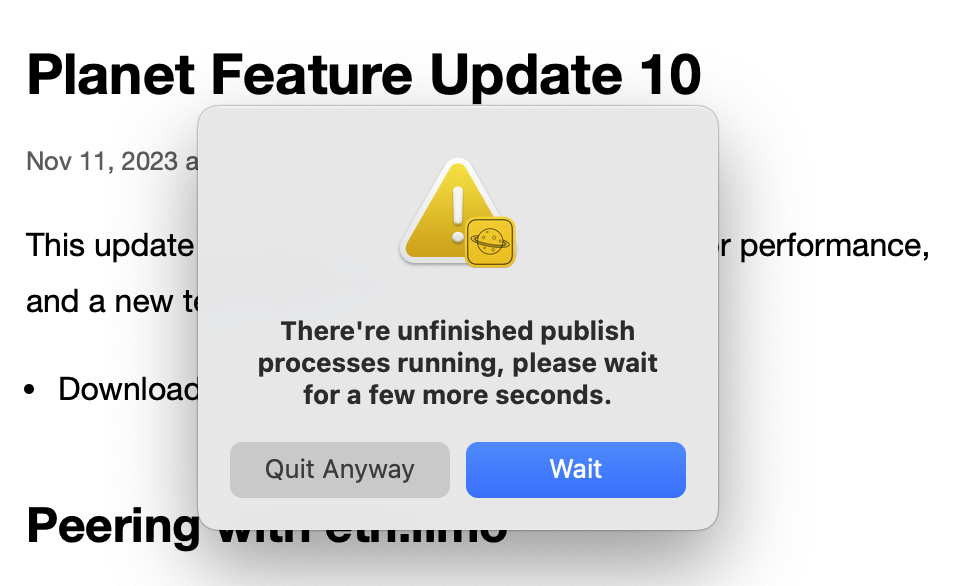

This update contains important improvements for performance, and a new template design: Sepia!

## Peering with eth.limo

[eth.limo](https://eth.limo) is the best gateway for ENS websites. Now, with direct peering added, your new content will show up faster on eth.limo because direct peering can significantly reduce the time eth.limo spends connecting with your local IPFS node.

## New Template: Sepia

Sepia is a brand new template that is great for microblogging.

Here is a [demo site](https://gateway.v2ex.pro/ipns/k51qzi5uqu5dgpbgbc7c3w2wjpsyqb28l5205znvbegmn5p7koctjuvgxb56r1/) of the new template.

Features:

- Show the latest content in chronological order
- Minimalist two-column design on desktop
- Responsive design works great on both desktop and mobile
- Supports video, audio, and multi-picture content
- Supports tags and archives

We'll continue to improve this new template as we receive feedback from you. In the next update, we'll introduce a whole new editor designed for microblogging.

## Improved IPNS Publishing

A confirmation dialog will now show if you try to quit the app while it is performing IPNS publishing (indicated by an animating hourglass in the sidebar). Previously, quitting the app during this process could result in unfinished IPNS publishing and cause the website to fail to resolve.

This improvement should significantly reduce the possibility of an IPNS site being unable to resolve.

## Improved Rebuild

Now there are two types of rebuild: Quick Rebuild and Full Rebuild. A Quick Rebuild will only regenerate the site's homepage file, index.html. A Full Rebuild will also regenerate every single post with your currently selected template for the site. Quick rebuilding is useful when you are debugging a SPA (single page application) template, such as [Croptop](https://revnet.eth.limo).

## Misc. Fixes and Improvements

- Fixed an issue where attaching files on macOS 14 was not working
- Fixed an image interpolation setting that caused blurry avatars
- Fixed an issue where the favicon was not removed when the avatar was unset
- Added support for pasting images with the Quick Share dialog
- Added Bonjour advertising for the Planet API service
- Added a random pick feature in the Avatar Picker
- Added a new API endpoint: `/v0/id`