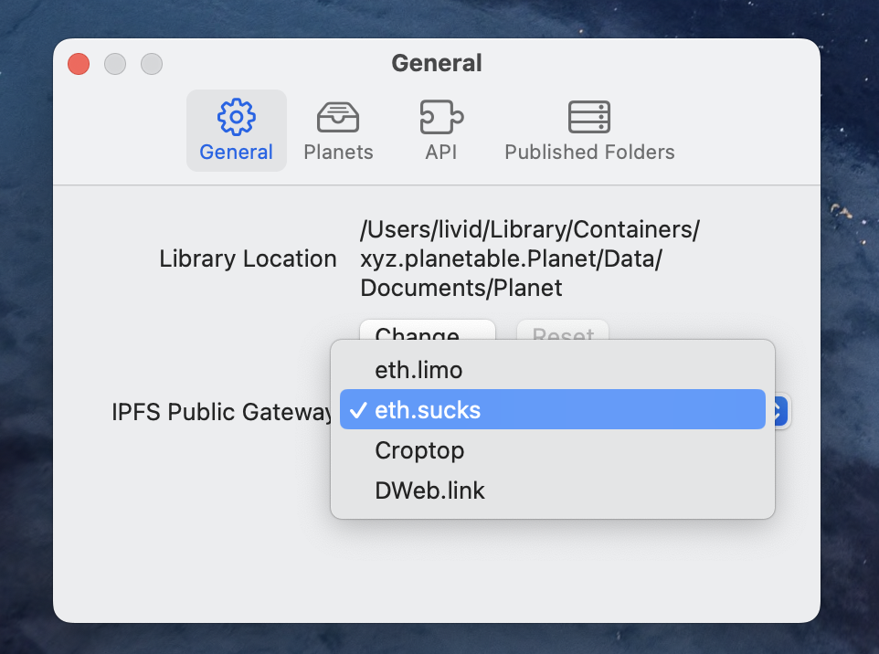
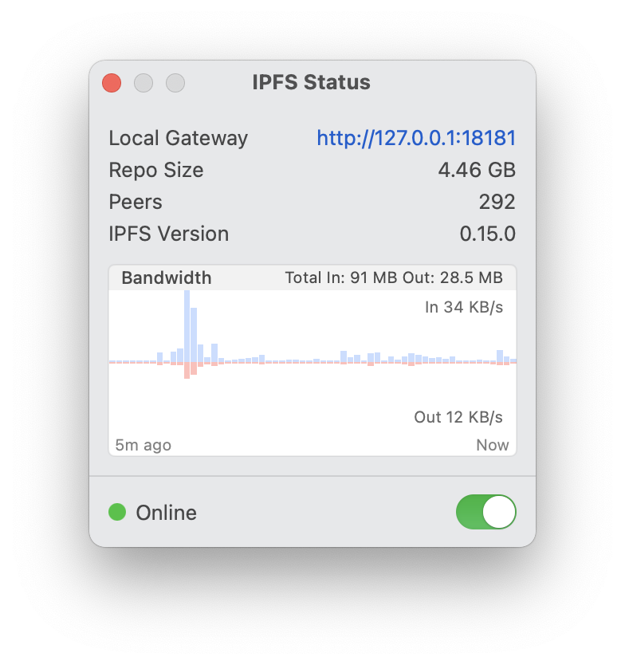
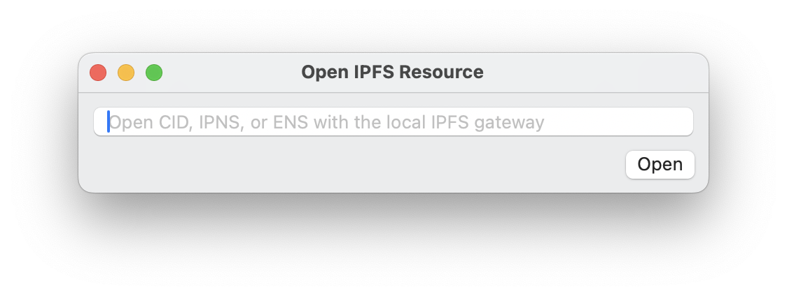
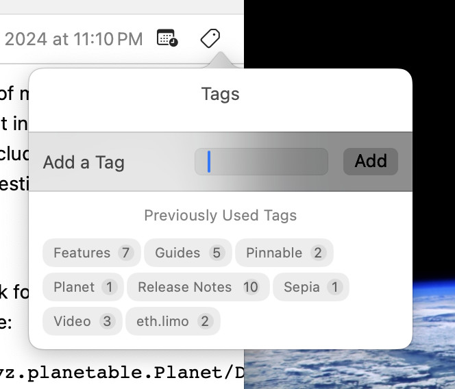
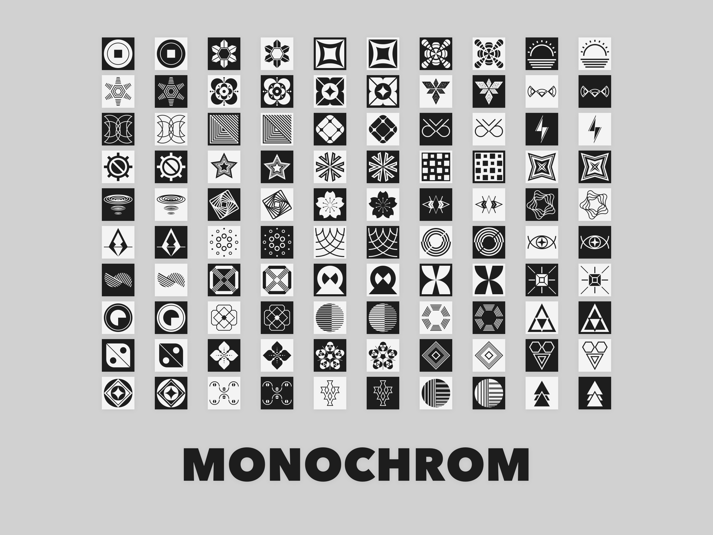
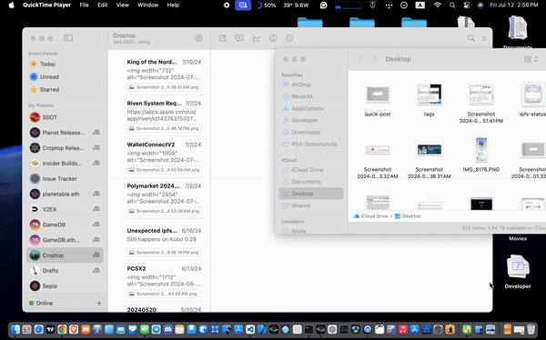
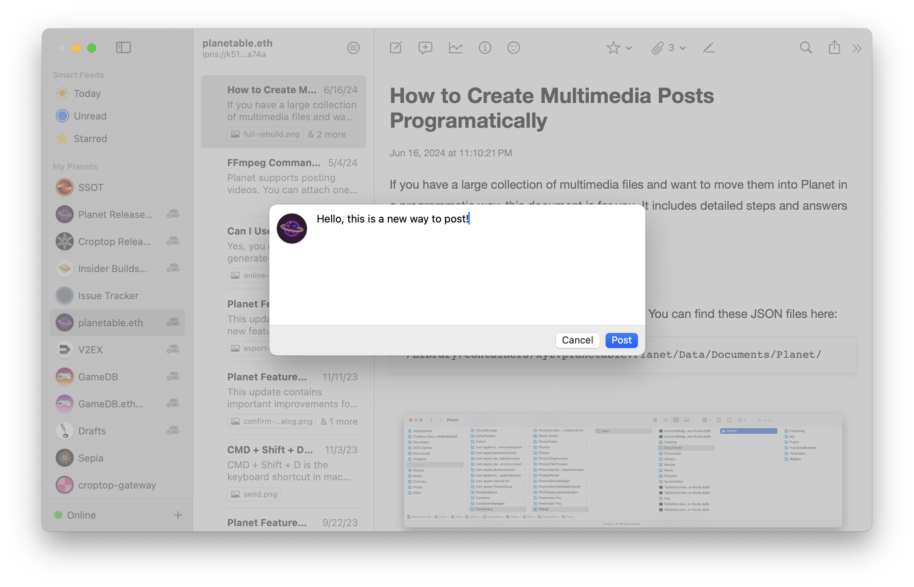

更新了对 WalletConnect 的支持，众多针对 IPFS 的改进和新功能，全新的 Monochrom 头像图片集，及其他使用体验上的改进。

- 下载 [Planet 0.18.2](https://github.com/Planetable/Planet/releases/download/release-0.18.2/Planet.zip)

## WalletConnectV2

Planet 更新了对 WalletConnect 的支持，升级到了 WalletConnectV2 版本。现在你可以使用手机钱包，比如 Rainbow，OKX 在 Planet 里登录，并用来向你关注的内容创作者打赏 ETH。同时，作为一个重要的基础架构，这也让将来 Planet 支持其他更复杂的合约调用成为可能。

## 新的 IPFS+ENS 网关

当你为站点生成分享链接时，现在可以使用一个新的高性能 IPFS+ENS 网关 eth.sucks。在任意设定了 content hash 的 ENS 末尾加上 .sucks 就可以访问上面的 IPFS 网站，比如：

* [vitalik.eth.sucks](https://vitalik.eth.sucks)
* [olivida.eth.sucks](https://olivida.eth.sucks)
* [gamedb.eth.sucks](https://gamedb.eth.sucks)
* [justinyan.eth.sucks](https://justinyan.eth.sucks)
* [jango.eth.sucks](https://jango.eth.sucks)
* [jbdao.eth.sucks](https://jbdao.eth.sucks)

可以从设置中选择这个新的网关。

前段时间，Cloudflare 宣布他们会[停止维护 cf-ipfs 网关](https://blog.cloudflare.com/cloudflares-public-ipfs-gateways-and-supporting-interplanetary-shipyard)。所以，目前，还能用的 IPFS+ENS 网关，就是这些了：

- [eth.limo](https://eth.limo)
- [ipfs.io](https://ipfs.io) / [dweb.link](https://dweb.link)
- [eth.sucks](https://eth.sucks) / [crop.top](https://crop.top)

一个健康的生态系统需要更多的参与者。

## IPFS 控制面板

现在点击左下角显示 Online 的区域，会看到一个新的 IPFS 控制面板：

显示 IPFS 的版本信息，空间占用，及实时的带宽消耗。如果需要，甚至可以从这个控制面板里暂时关闭 IPFS 进程。

## 用本地 IPFS 网关打开任意 IPFS 资源

现在可以从 File 菜单下找到一个新的 Open 选项，用它来打开任意的 IPFS 或者 ENS 资源地址。

## 复用 Tags

在为内容选择 tag 时，现在可以从之前已经用过的 tag 里点击选择。

## 新的站点头像图片集 Monochrom

99 个全新设计的站点头像图片。

在站点设置中，可以选择在保存新的站点头像图片时，存储为圆形图片。这样做的用途是，如果你希望在浏览器的收藏夹中也显示圆形图片，而不是默认的方形。

## 新的快速分享拖拽

可以用拖拽任意图片放到文章列表，就可以打开一个新的快速分享发帖方式。

## 新的短文本输入发送

按下 <kbd>CMD</kbd>+<kbd>D</kbd> 就可以打开一个新的短文本输入发送框，配合 Sepia 主题，很适合用来记录和分享一些简短的想法。

Click on the toolbar or use the keyboard shortcut <kbd>CMD</kbd>+<kbd>D</kbd> to access this new input designed for microblogging.

比如这是一个使用 Sepia 主题的 microblog 站点：

[sepia.olivida.eth](https://sepia.olivida.eth.sucks)

## 其他修复和改进

- 修复了一个会发生在 macOS 12/13 上的文章列表异常。如果你使用的是 macOS 14 那么不会遇到这个问题。
- 可以在搜索结果列表中使用键盘上下选择结果打开。
- 模版中现在可以读取到文章主图（hero image）的高宽信息。
- 站点 IPNS 发布完成时，会用本地通知方式显示最新的 CID。
- 新的站点设置：Do Not Index。写入一个 robots.txt 规则文件告知搜索引擎不要索引网站。
- 新的站点设置：Prewarm。每次新文章发布时，Planet 会自动在当前选择的公共网关上访问一次新文章地址，这样新文章在公共网关的 IPFS 节点里就会有一份新鲜的副本，让其他访问者可以更快打开内容。
- Insider 版本现在会有一个单独的二进制文件名称 `Planet-Insider` 以更方便地和其他版本共存。
- 增加了 Filebase 节点的 Peering。