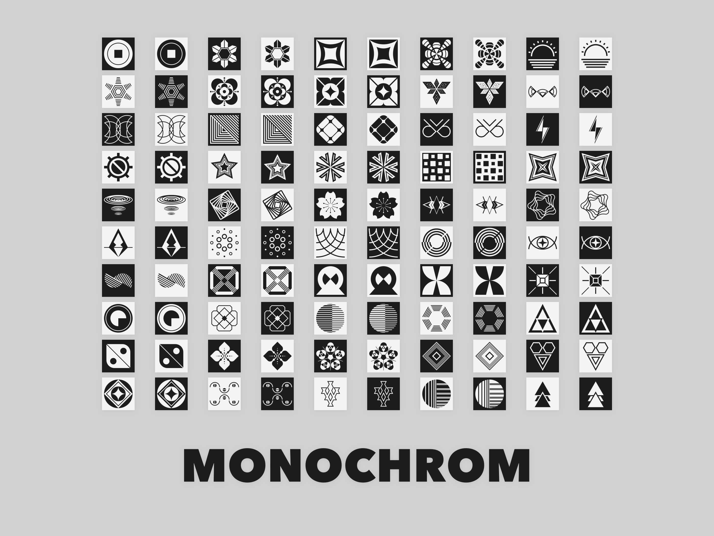

## WalletConnectV2

We've updated the Wallet Connect integration. Now, you can easily scan a QR code to connect your wallet and tip your favorite creators. This update also paves the way for additional Ethereum and L2 features.

## New IPFS/ENS Gateways

There is a new fast gateway for IPFS/ENS websites, and you can select it from Settings. You will get shareable links on the eth.sucks or crop.top domains.

Currently, the two new domains are running on the same backend. In the future, they may each have their own backend.

By the way, Cloudflare has decided to [no longer maintain its IPFS gateway](https://blog.cloudflare.com/cloudflares-public-ipfs-gateways-and-supporting-interplanetary-shipyard). As of this writing, there are really only three usable general gateways for DWeb:

- [eth.limo](https://eth.limo)
- [ipfs.io](https://ipfs.io) and [dweb.link](https://dweb.link)
- [eth.sucks](https://eth.sucks) and [crop.top](https://crop.top)

## IPFS Control Panel

A new IPFS control panel displays the IPFS version, peer count, and a live chart of bandwidth usage.

## Open Any IPFS Resource with the Local Gateway

You can find a new Open menu under File, or use the keyboard shortcut CMD+O to open any IPFS resource with the local gateway.

## Easily Reuse Tags for Your Posts

You can now select from previously used tags when adding tags to your post.

## New Avatar Set: Monochrom

99 new black-and-white avatar images for your Planet site. A new setting allows you to save a circular version of the avatar to better fit certain template designs.

## New Quick Share Gesture

Simply drag and drop an image into the article list to share it.

## New Quick Post Input

Click on the toolbar or use the keyboard shortcut <kbd>CMD</kbd>+<kbd>D</kbd> to access this new input designed for microblogging.

## Fixes and Improvements

- Use keyboard to navigate between search results.
- Use `//` or `#` as comment lines in aggregation settings.
- Hero image width and height are included in the variables for templates.
- A local notification will appear when a new CID is successfully published to IPNS.
- New Planet setting: Do Not Index. You can ask search engines not to index the site by adding a robots.txt rule file.
- New Planet setting: Prewarm. The app will access a newly published post on the currently selected gateway, creating a cached copy on the gateway to make future access faster.
- Insider builds now have the `Planet-Insider` name for binaries, allowing them to coexist with regular builds.
