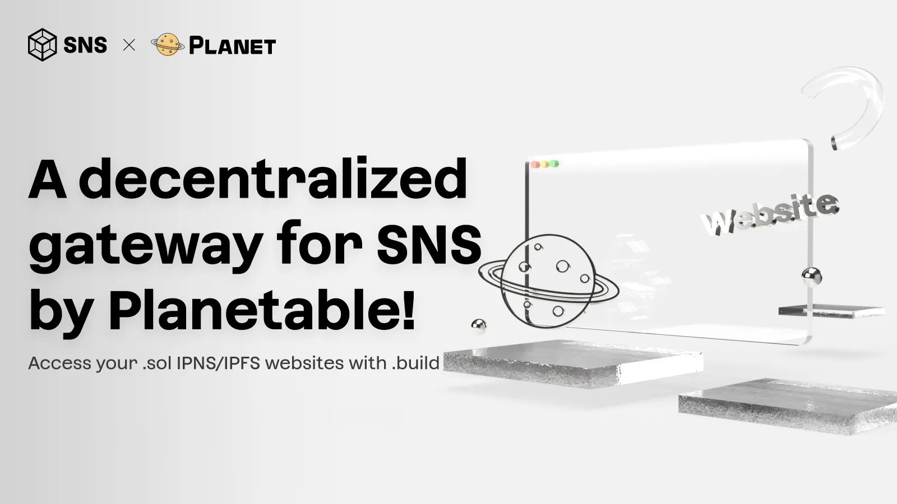
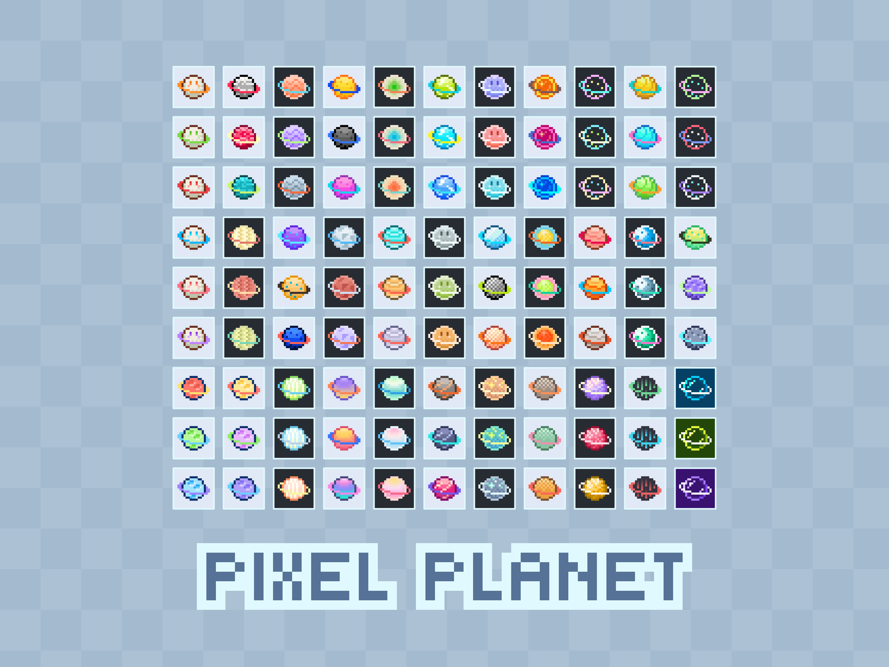

Planet Feature Update 14 - Solana Name Service · New Avatar Set: Pixel Planet · Web Client

- Download: [Planet 0.20.1](https://github.com/Planetable/Planet/releases/download/release-0.20.1/Planet.zip)

## Solana Name Service

Solana Name Service is the most popular name service on the Solana blockchain. You can get your .sol names at <a href="https://sns.id/" target="_blank">sns.id</a>. For names with 5 or more characters, it's a one-time payment of $20 USDC per name. For short names, it may cost more. The initial cost is a little bit more than ENS, but you don't need to renew, and gas cost to do anything on the Solana blockchain is really low-cost and fast.

You can link your Planet site's IPNS address to your .sol names, and it can be accessed with the new <a href="https://sol.build/" target="_blank">sol.build</a> gateway. Or access it with the local gateway in Planet, it has fully support for .sol now.

For example, this site is now also available on .sol as:

<a href="https://planetable.sol.build/" target="_blank">planetable.sol</a>

## New Avatar Image Set: Pixel Planet

Pixel Planet is a lovely new avatar image set designed by Ann. You can find it from this smile button on the toolbar, and use one of them as your site avatar image.

Hope you will like it.

## Web Client

We have been improving Planet's API server, and it now powers a brand new web client that can let you access Planet from any browser.

You can find this new web client by appending `/app/` to your API server IP and port. For example, if your API server port is 8086, then the web client is available on:

http://127.0.0.1:8086/app/

You can find your API server info in Settings.

In previous version, you need to manually install the web client. This is no longer needed, Planet now has built-in updater to automatically install and update the latest web client.

## Experimental Gateway for Farcaster Profile URL

furl.pro is an experimental IPFS gateway for the URL field in Farcaster profile.

If you set an IPNS or IPFS address to your Farcaster profile URL, then you can access it with [your-fc-username].furl.pro. For example:

[livid.furl.pro](https://livid.furl.pro/)

URL field is part of the Farcaster protocol, but it is currently not exposed in the Warpcast client. You can update the field with a third-party client like <a href="https://recaster.org/" target="_blank">Recaster</a>.

## Other Fixes and Improvements

- Fixed various RPC issues that could affect ENS resolution.
- Implemented a button for manually triggering IPFS garbage collection.
- Resolved multiple UI issues on macOS Sequoia.
- Fixed several API performance issues.