# Planet Feature Update 8

下载地址：

* <a href="https://opensource.planetable.xyz/planet/release-0.14.1/Planet.zip" target="_blank">Planet 0.14.1</a>

## Article Settings 及新的文章列表视图

增加了一个新的 `Article Settings` 右键菜单。可以用来将一篇博客文章设置为 Page。这对于创建像 About Us 和 Contact Us 之类的站点级别页面会特别有用。

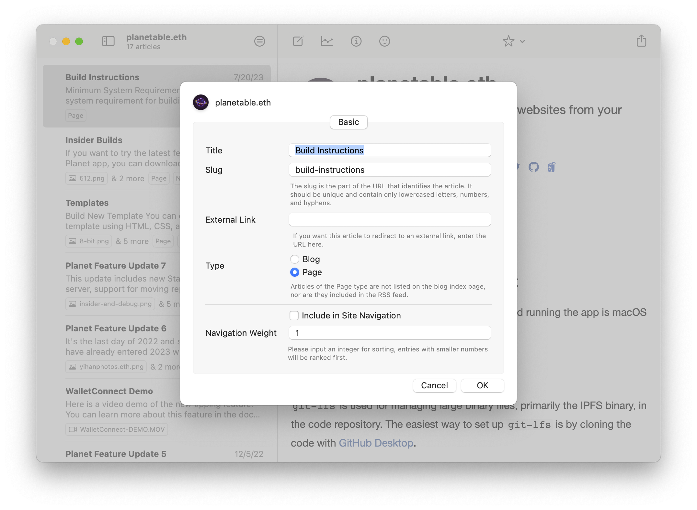

通过这些新设置，你可以获得类似 [planetable.eth](https://planetable.eth.limo) 顶部这样的网站导航设计。这可以通过指定某些文章作为网站导航栏中的条目来实现。

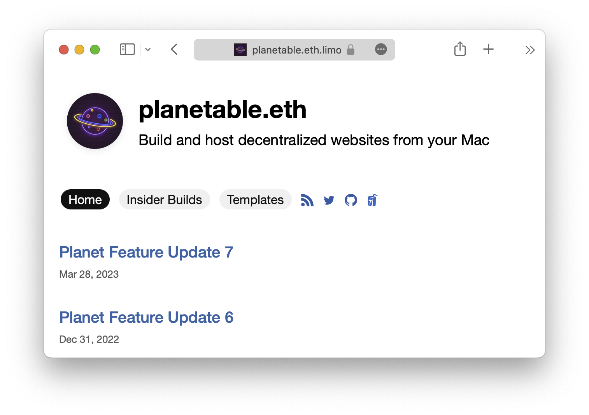

通过点击这个新的列表过滤器，你可以按类型过滤文章，更容易地找到特定页面。

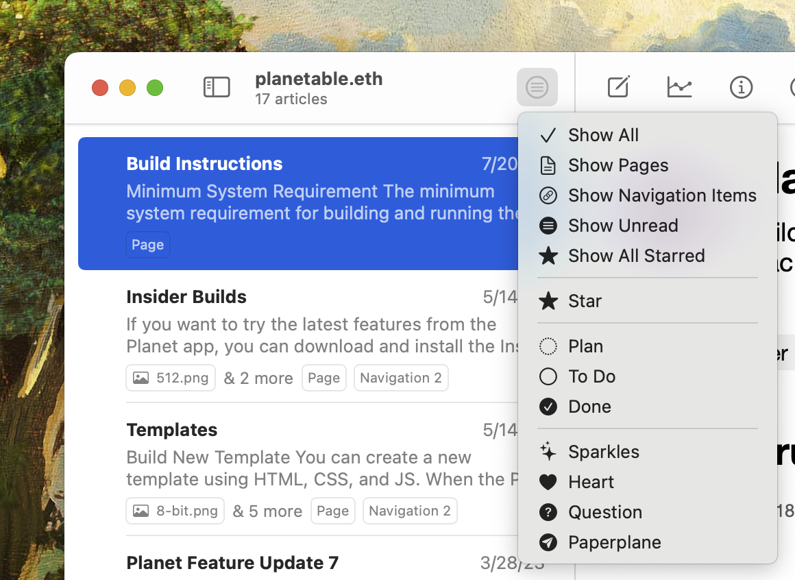

重新设计过的文章条目视图现在会显示内容类型及附件信息。

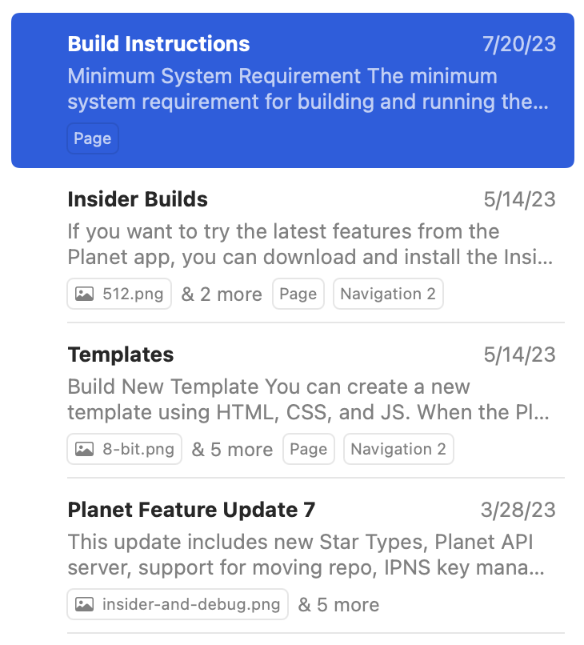

## Planet Avatar Picker

Planet 现在有一个全新的头像选择界面。让你可以从多组充满设计感的图集中选择一张作为你的 Planet 网站的头像。

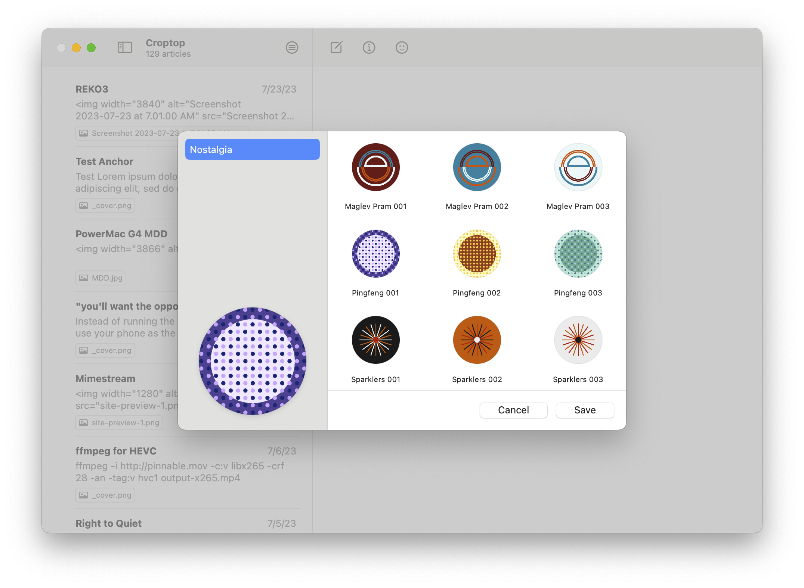

这次上线的第一个图集，Nostalgia，包含了 99 个简洁而抽象的来自设计师 [yihanphotos.eth](https://yihanphotos.eth.limo) 的作品。

## 快速分享

现在你可以把图片拖拽到 Planet 图标上，就可以快速分享图片。

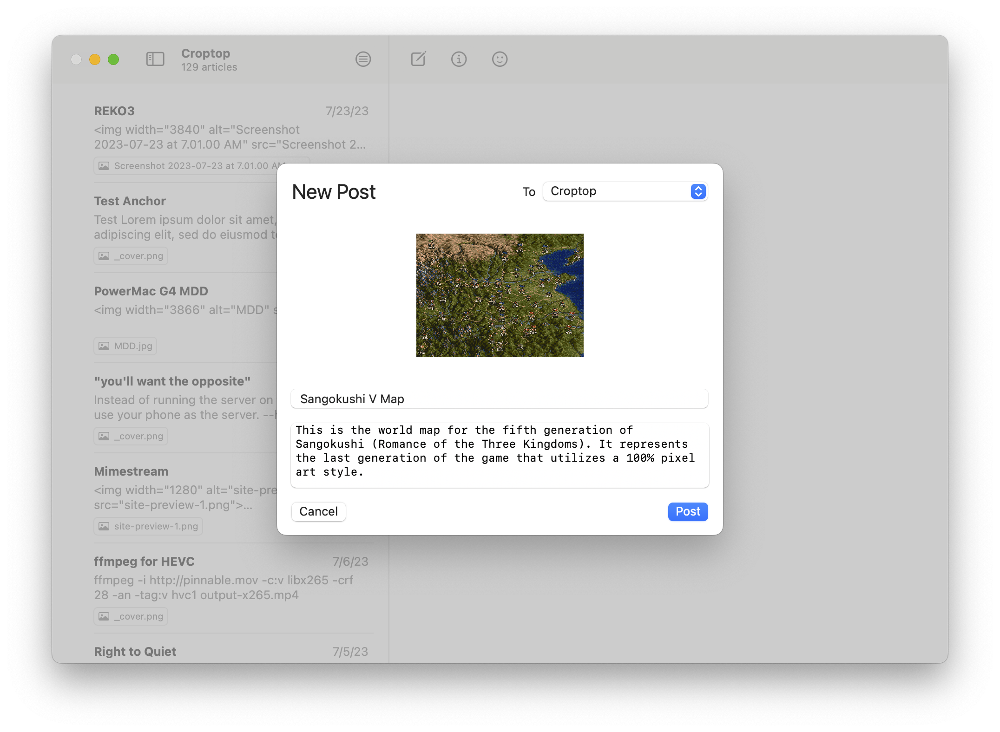

## Pinnable

[Pinnable](https://pinnable.xyz) 是一个全新的用于 ENS/IPNS 网站的 Pinning 服务。

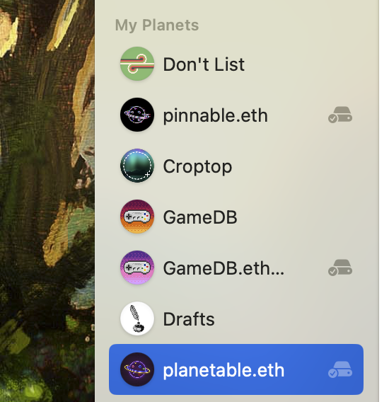

当你使用 Planet app 创建和发布去中心化网站时，你的 Mac 会成为 P2P 网络上的一个节点，用于托管你的网站。通过使用一个 Pinning 服务，你的网站内容的额外副本会被复制到 Pinning 服务的节点上，这样可以让网站的加载速度更快，同时也增加了内容的可达性（availability）。尤其是对于笔记本用户，就不用让电脑一直开着作为服务器。每次当你发布新内容时，Pinnable 就会开始与你的本地节点进行同步，同步完成之后，你的内容就也存了一份到 Pinnable，这样你就不用一直开着自己的机器作为服务器了。

虽然使用了一个远程服务，你对内容的权威版本依然具有完全的控制。远程服务无法篡改或者删除你的内容。

## To-Do 列表语法

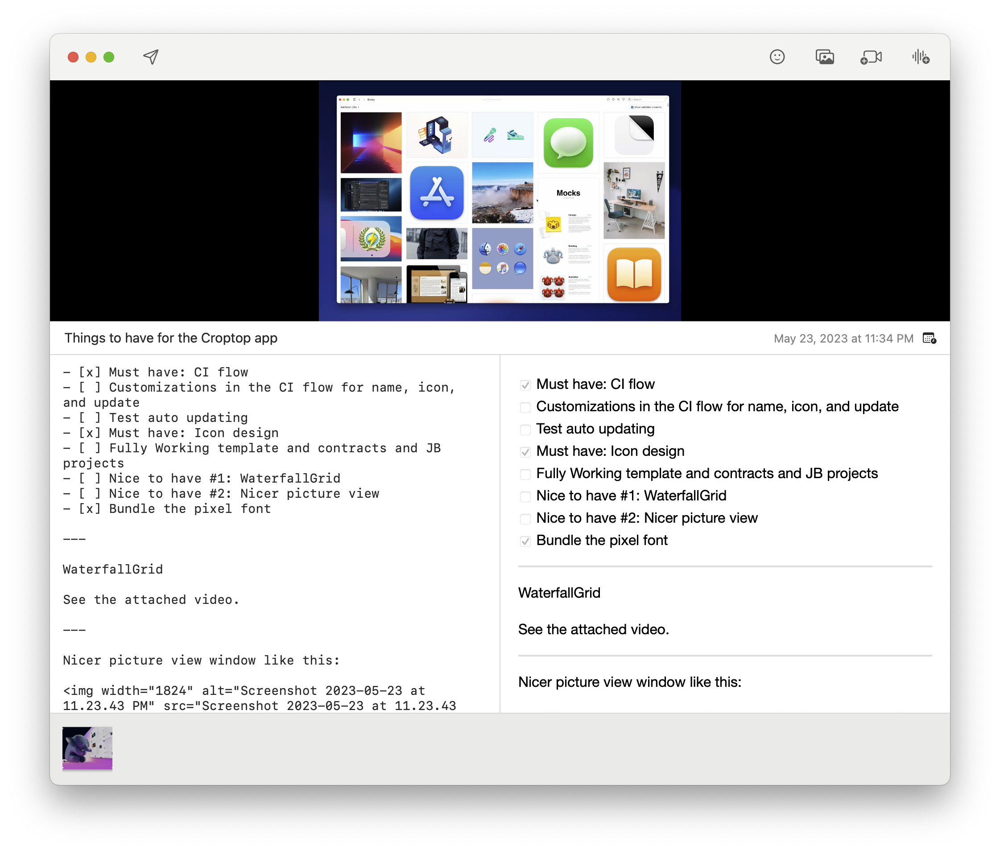

Planet 的 Markdown 编辑器现在也可以支持类似 GitHub 的 To-Do 语法。并且在 My Planet 的右侧视图中，可以直接点击 To-Do 列表中的项目来勾上已经完成的事项。

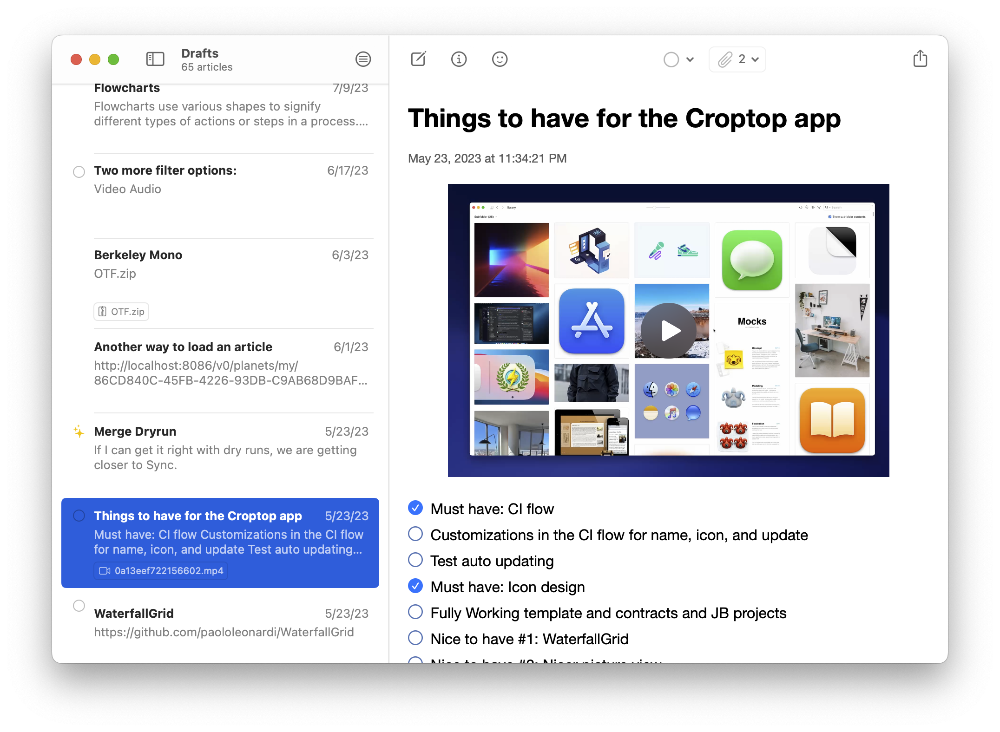

## YouTube 嵌入

如果你在正文中包括了一个 YouTube 的视频链接，那么现在链接会自动转化为一个播放器。

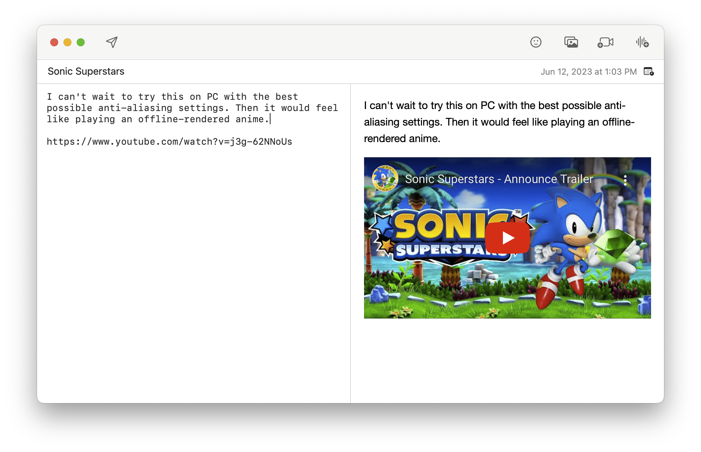

## 其他改进

- 支持用拖拽的方式调整左侧列表中 My Planet 和 Following Planet 的顺序
- 在 Rebuild Planet 时现在会显示一个进度条

<figure>
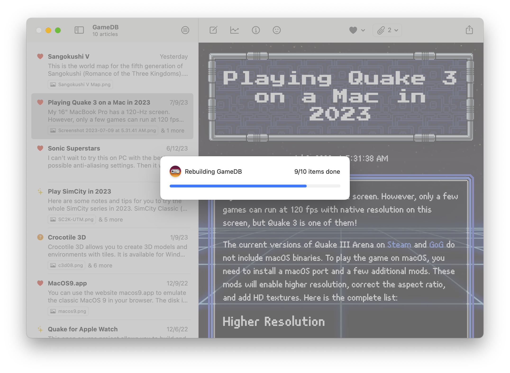
<figcaption>Rebuild Planet 时的进度条</figcaption>
</figure>

- 修复了移动文章时的一个问题
- 修复了当 App 长时间运行时可能会发生的一个崩溃问题
- 模版现在可以有自己的设置，这为更复杂的定制模版功能打开了可能性
- 增强了 Markdown Writer 在滚动时的性能
- Markdown Writer 的时间选择器现在可以选择「今天」
