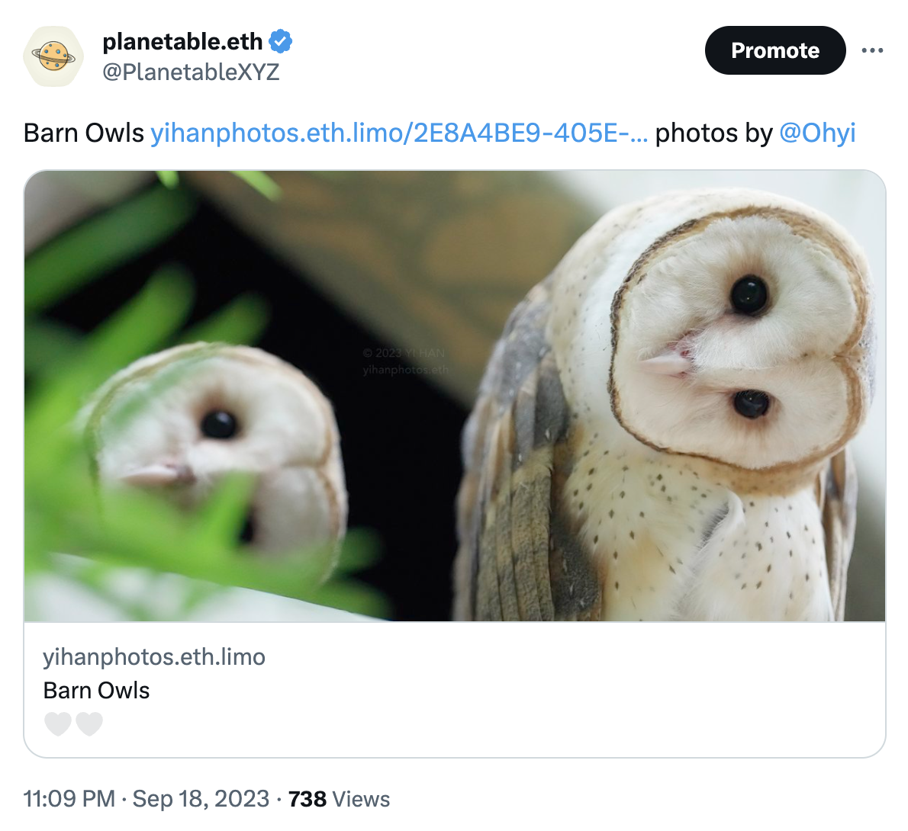

# Planet Feature Update 9

在这次的功能更新中，使用 Planet 来进行博客写作的体验更加完整了。我们非常高兴为你带来这些新功能：标签，归档，增强的 Pinning 服务支持，及一个在 Dock 上的动画图标！

* 下载 [Planet 0.15.0](https://github.com/Planetable/Planet/releases/download/release-0.15.0/Planet.zip)

## Tags

你现在可以使用 Article Settings 或者 Writer 界面上的图标来为文章设置标签。

每个标签会有自己的页面。这样的话，具有同样标签的所有内容就可以在一个页面上看到。

比如，这是 Planet 的所有功能更新的博文，使用的是 `Release Notes` 这个标签。

https://planetable.eth.limo/release-notes.html

## Archive

增加了一个全新的归档页面。在这个页面上可以看到所有的历史内容。

Planet 的三个内置主题都已经为这次的新功能（标签和归档页面）做了更新。

## 更改 App 图标

新增了 Icon Gallery 让你可以为 App 选择一个新的图标。

如果你持有 [Pinnable NFT Series A](https://juicebox.money/v2/p/471)，那么你还可以解锁两个具有动画特效的图标。

要使用这些 NFT 图标，你需要首先连接你的钱包。你可以使用手机上的 [Rainbow](https://rainbow.me) 钱包来实现在 Planet 里的扫码登录。

## 选择主图

当一篇文章具有多个附图时，你可以选择其中的一张作为主要图片（Hero Image）。主要图片会在当文章被分享到其他社交网络时显示。比如当文章链接被分享到 Twitter 或者 Discord 时。

<figure>

<figcaption>设置了 Hero Image 之后在 <a href="https://twitter.com/PlanetableXYZ/status/1704014946416431121" target="_blank">Twitter</a> 里分享链接的效果</figcaption>
</figure>

## 增强的 Pinnable 支持

我们继续改进了在上一个版本中引入的 [Pinnable](https://pinnable.xyz) 集成。现在当你为网站启用 Pinnable 服务时，各类交互的结果会以更及时的方式反馈。

<figure>

<figcaption>表示网站已经被 pinned 的图标</figcaption>
</figure>

当你的网站名称右侧出现这个图标时，意味着 Pinnable 已经成功保存了副本。如果你使用的是笔记本电脑，这个时候你可以放心地合上盖子，你的网站会继续通过保存在 Pinnable 服务器上的副本来提供服务。当启用了 Pinnable 的服务时，从各种 IPFS 网关访问你的网站的速度和可用性都会得到提升。而你依然完全控制着网站内容的权威版本。