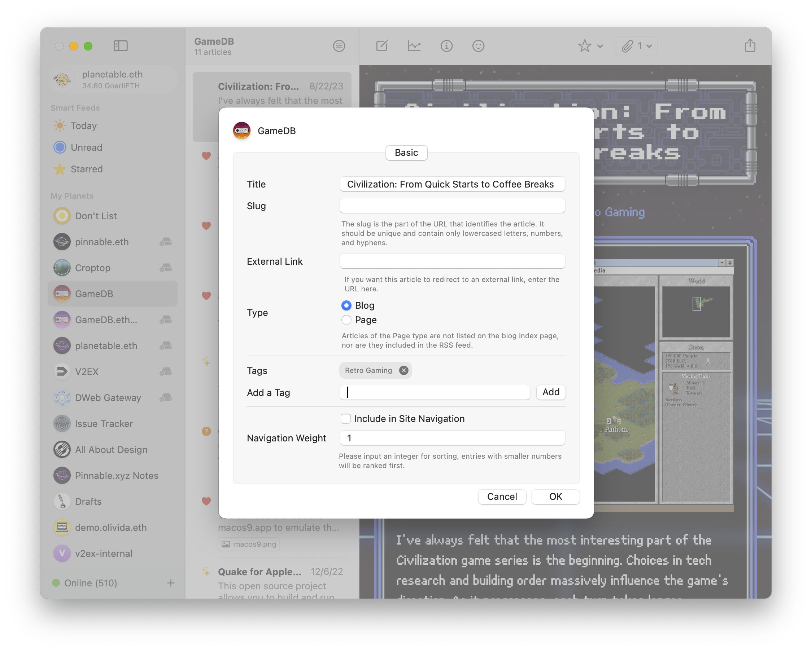
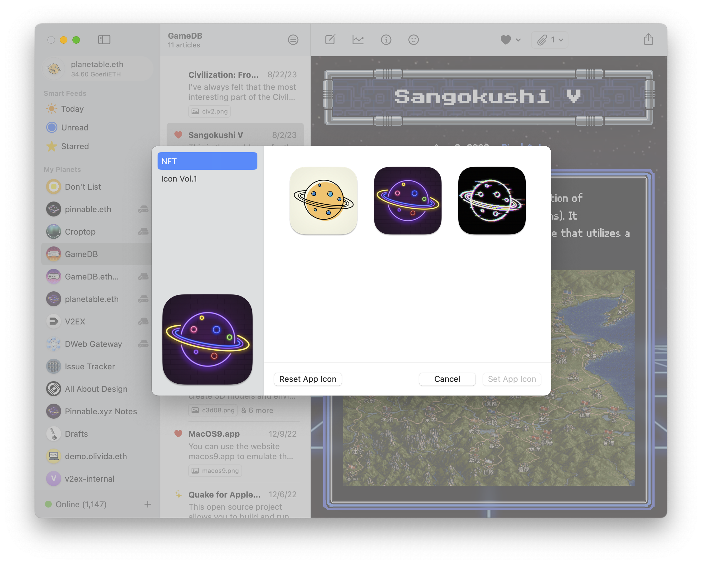
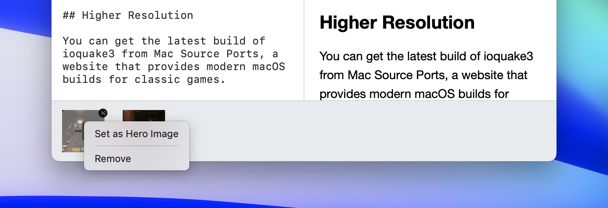

# Planet Feature Update 9

In this update, blogging with Planet is now a more feature-complete experience! We are so excited to bring you Tags and Archive, as well as enhancements for pinning.

## Tags

You can now add tags to posts either through Article Settings or via a new tagging icon in Writer.

Each tag will then generate its own page, so all posts with that tag can be viewed from one page.

## Archive

A new Archive page has been added. It contains links to all the posts on the site.

We have updated the three built-in templates to accommodate the new Tags and Archive features.

## Change App Icon

A new Icon Gallery has been added for you to choose a new icon for the Planet app.

If you own Pinnable NFT Series A, then you can unlock two special icons that have animations in the Dock upon startup.

To use this animated icon, first you need to connect your Ethereum wallet. You can do so by scanning the QR code with the [Rainbow](https://rainbow.me) Wallet app on your phone.

## Select Hero Image

When you have multiple images attached to a post, you can now select one of them as the hero image. The hero image will be displayed when you share the post link on social sites like Twitter or Discord.

## Enhancements for Pinnable

Multiple enhancements have been implemented for the [Pinnable](https://pinnable.xyz) integration. Now, when you enable Pinnable for your Planet sites, you will experience more instantaneous feedback from the service.

<figure>

<figcaption>The icons next to the Planet site title mean it's pinned.</figcaption>
</figure>