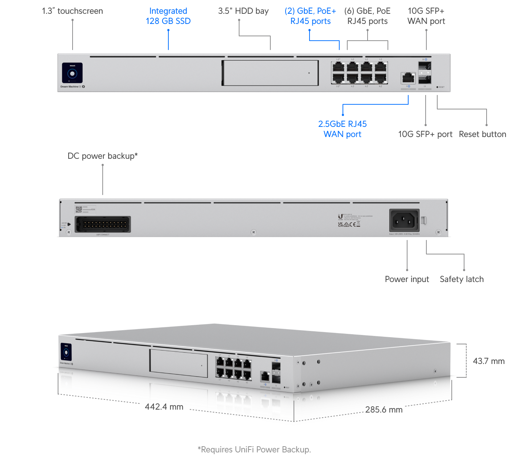
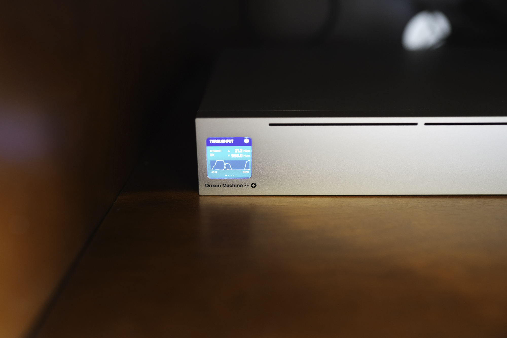
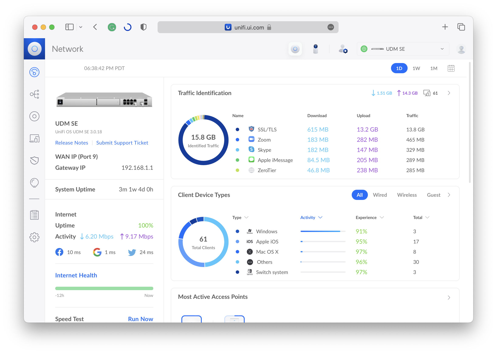
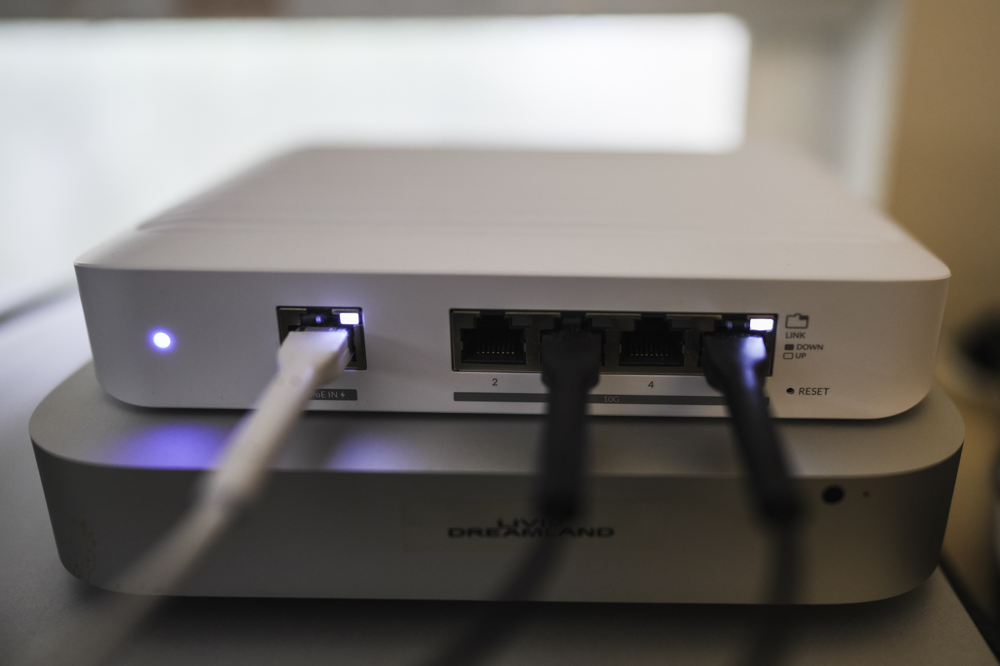

# 最近升级了一下家里的网络设备

一直在关注的朋友可能知道，我在去年的时候开始做一个新的 macOS 上的原生应用 [Planet](https://planetable.xyz)。Planet 本质上是一个带有图形界面的 Markdown 编辑器加静态网站生成器，然后比较特别的是内置了 IPFS 节点。所以用 Planet 构建好网站之后，就可以直接通过内置的 IPFS 服务器向互联网提供服务。

比如这是我新的中文博客的 IPFS 地址：

https://ipfs.io/ipns/k51qzi5uqu5dgbfw2poynnynor8h9kqqoxmzdrxy4h4wnzx1x5p4n40ijtosxk/

其中 k51 开头的那串很长的字符串就是 IPNS 地址，可以进一步绑定到其他基于 blockchain 的域名服务上，比如 ENS 和 .bit，然后通过他们的公共网关，就可以在普通浏览器上访问：

- https://olivida.eth.limo/
- https://olivida.bit.site/

那么如果 Planet 应用是跑在笔记本电脑上怎么办？毕竟笔记本是不可能整天 24 小时开机来作为服务器的。所以我的解决方案是在家里的 Linux 服务器上也安装了 go-ipfs 服务器进程，然后在 crontab 里加上这样一句，就可以不到 1 分钟的延迟，让 Linux 服务器和跑在笔记本上的 Planet 应用里发布的网站实现数据同步：

```
* * * * * /usr/local/bin/ipfs pin add /ipns/k51qzi5uqu5dgbfw2poynnynor8h9kqqoxmzdrxy4h4wnzx1x5p4n40ijtosxk
```

然后这么跑了一段时间之后，遇到了一件尴尬的事情——有的时候家里的网关就卡住了，只能拔电重启，但是过一段时间就又不行了。

家里用的是一台 2017 年入手的 UniFi Security Gateway。应该是 UniFi 出品的最小的一台网关了。因为没有风扇，所以很安静。但我发现每次它卡住的时候，表面温度都到了烫手的程度，估计是 Linux 服务器上的 IPFS 带来的负载。因为那台 Linux 服务器上不只是 pin 了我自己的 IPFS 网站，也 pin 了很多朋友的内容，比如 Justin 的枫言枫语播客的 IPFS 版本（里面有 5GB 的音频内容）：

https://justinyan.eth.limo/

所以估计是 USG 不太够了。其实 2017 年我最先入手的是 UniFi 的 Security Gateway Pro 4。理论上 USG-PRO-4 的性能，在现在这样的时候场景里也是够的，但是因为那个机器的风扇稍微有点响，所以后来才换成了没有风扇的 USG 小机器。

反正也用了 6 年了，要不升个级？于是我开始研究 2023 年能买到的 UniFi 的最新的网关产品。

## UniFi Dream Machine SE



[UDM-SE](https://store.ui.com.cn/collections/unifi-network-unifi-os-consoles/products/dream-machine-se) 是 UniFi 的网关产品里最新的一个型号。外形和 USG-PRO-4 差不多，都是 rack mount 造型。但不同于通常的 rack mount 设备的工业化质感，UniFi 专业网关产品的表面是一种类似银色 Mac mini 的质感。你可以想象如果苹果的 Xserve 产品线还在继续出新品的话，大概就是这样的质感。UDM-SE 左侧多了一块小屏幕，可以用来看到实时的网速和进行一些简单的设置。



入手之前在 Reddit 和 YouTube 上搜了一下关于风扇噪音是否有人吐槽，然后基本上没有看到，于是就入手了。开机之后没有让我失望——风扇相比 USG-PRO-4 进步很大，很安静。于是塞进电视机柜里用也完全没有问题。

除了内部的 CPU 升级，UDM-SE 还提供了一个单独的 2.5G 的 WAN Uplink 网口，这样将来如果宽带运营商提供 2G 的下行，那么就可以用上了。

因为 UDM-SE 本身就可以跑 UniFi Network 及内置了硬盘接口，所以这次升级不仅换下了之前的 USG，同时之前专门用来跑 UniFi Network 的 UCK-G2 也换下了。

整个替换过程很顺畅，把 UCK-G2 里的配置文件备份，然后导入新的 UDM-SE，就可以开始用了。

UniFi Network 是 UniFi OS 中用于管理所有网络设备的控制软件。通过 UniFi Network，可以很清晰看到和管理整个网络中所有 UniFi 设备，及所有用户设备的状态。



对于网络使用过程中的很多场景，UniFi Network 都提供了简便的图形化的配置方式，比如 Site-to-Site VPN、兼容古董设备的单独的 SSID 配置、IPv4/IPv6 各自的防火墙设置等等。这些配置在这次升级设备的时候，在一个备份文件里就可以导出导入。UniFi Network（之前的名字是 UniFi Controller）是我这么多年一直都在用 UniFi 产品的一个主要原因。

关于兼容古董设备的单独的 SSID 配置，我前段时间在中古店淘到了一台 2006 年上市的 Palm 设备 SONY TH-55，通过在 UniFi Network 里单独配置了一个 802.11b 的 SSID，成功让这台古董设备连上了网。

## Switch Flex XG

这次升级还同时增加了 [Flex XG](https://store.ui.com.cn/collections/unifi-network-switching/products/unifi-flex-xg) 用于这几年新增的几台 10G 设备：

- iMac Pro
- QNAP NAS
- Mac Studio
- Mac Mini M1

Flex XG 是一台很小巧的 10G 设备，提供 4 个 10G 的以太网口，和一个 1G 的 PoE+ 口，主要用于给设备供电。设备在运行的时候很安静，和 10G 设备一起放在桌面正好。



最近几年 UniFi 的产品线进行了很多扩充，已经不仅仅只是网络设备。在 US 的 Early Access 商店里，甚至开始出现网络供电和控制的 LED 面板、EV 充电站等等，都可以用一套 UniFi Network 控制软件管理起来。

如果你也打算入坑 UniFi，欢迎在这里讨论技术细节，我会尽我所能回答我知道的。