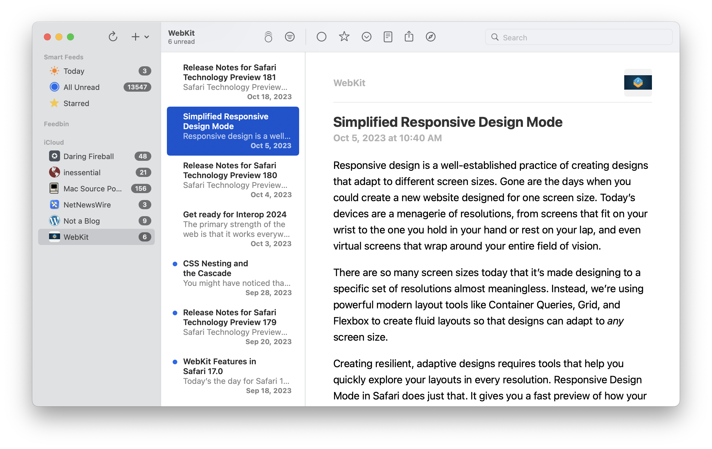
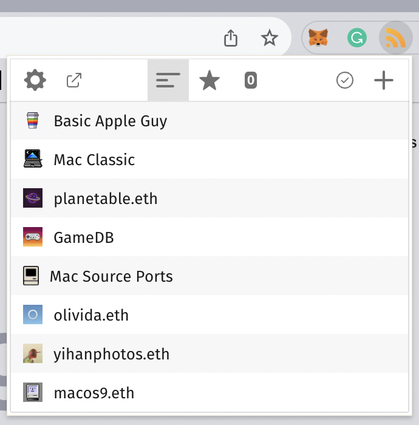

# V2EX 的 RSS 输出

V2EX 的几乎所有内容，都可以通过 RSS 订阅。这个文档描述的是几种不同类型内容的 URL 规则。及我们推荐的一些 RSS 相关的软件。

## 节点

V2EX 通过节点的概念来组织内容，每个主题只会属于唯一的一个节点。节点的最新内容可以通过 RSS 订阅。URL 规则是这样的：

比如当你访问「[程序员](https://www.v2ex.com/go/programmer)」节点时，这个节点的首页地址是：

https://www.v2ex.com/go/programmer

对应的 RSS 地址是：

https://www.v2ex.com/feed/programmer.xml

同时也支持 [JSON Feed](https://jsonfeed.org) 格式：

https://www.v2ex.com/feed/programmer.json

## 首页话题聚合

V2EX 的全站首页上有几个不同的 tab，用来将一类接近的话题汇聚成一个时间轴。比如这是所有关于技术内容的首页 tab 的地址：

https://www.v2ex.com/?tab=tech

对应的 RSS 地址是：

https://www.v2ex.com/feed/tab/tech.xml

## 全站首页最新内容

这个 RSS 地址是每天 V2EX 所有的新主题：

https://www.v2ex.com/index.xml

## RSS 客户端

如果你使用的是 Apple 系统，那么我们推荐 NetNewsWire。这是一款设计优雅，同时所有 Swift 代码开源的 RSS 客户端：

https://www.netnewswire.com/

如果你正在使用或者打算学习 Swift 编程，NetNewsWire 的代码库是一个很好的学习对象。

NetNewsWire 的高性能让人印象深刻。即使有上万的未读条目，用起来也完全不卡。背后的支撑是 [RSDatabase](https://github.com/Ranchero-Software/RSDatabase) 项目。

## Chrome 插件

Feeder 的 Chrome 插件可以把 RSS 渲染成一个好看的预览格式：

https://chromewebstore.google.com/detail/rss-feed-reader/pnjaodmkngahhkoihejjehlcdlnohgmp?pli=1

同时也可以在 Chrome 的工具栏里提供一个快速的查看自己订阅源最新内容的按钮。

