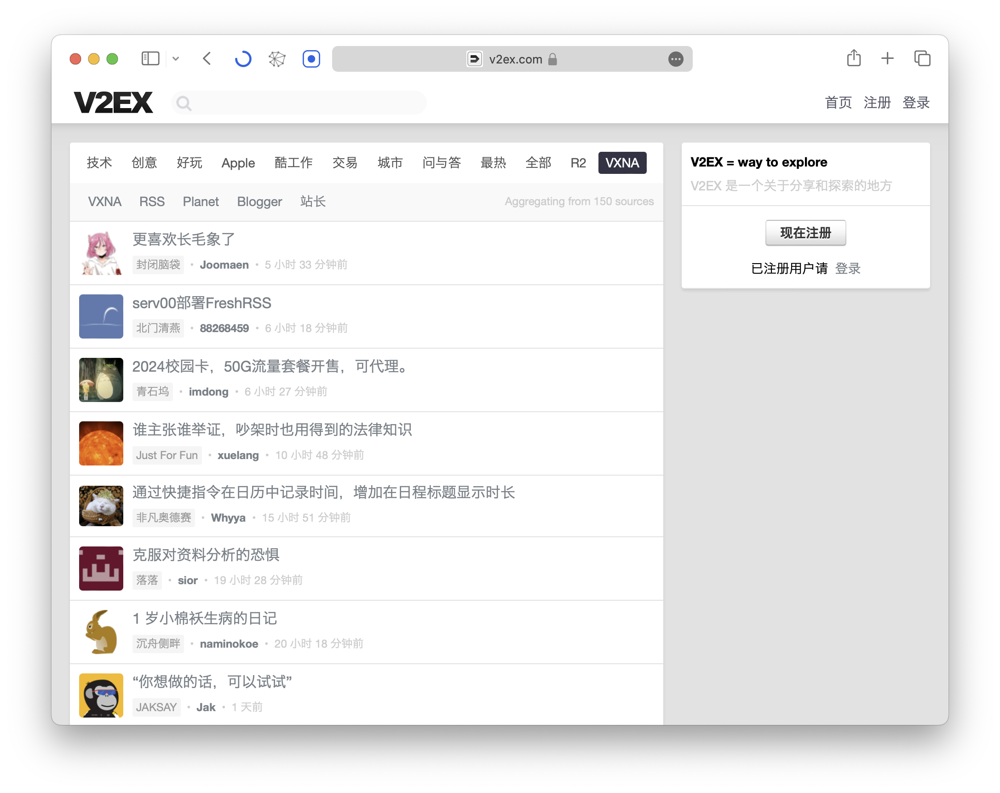
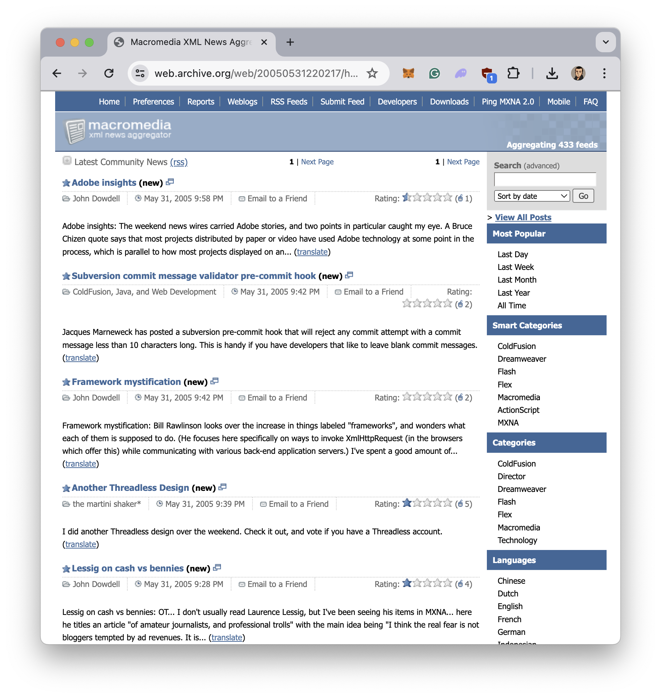
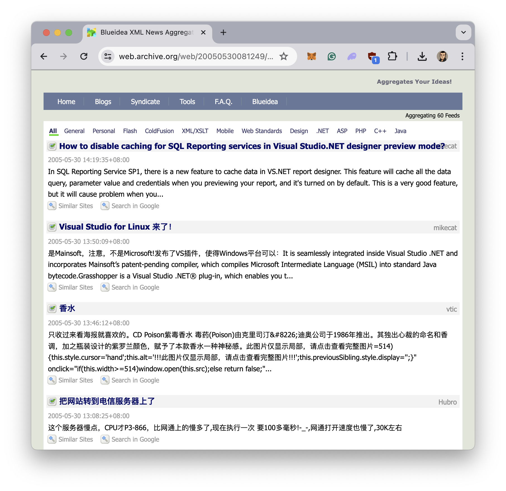
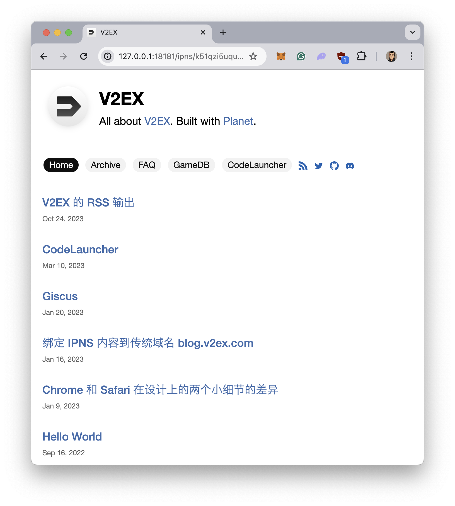

# VXNA

<a href="https://www.v2ex.com/xna" target="_blank">VXNA</a> 是 V2EX 的一个新功能——博客聚合器。如果你有自己的博客网站，那么可以在 <a href="https://www.v2ex.com/" target="_blank">VXNA</a> 节点申请被收录。如果被收录，那么就会被定期聚合到 V2EX 首页。

V2EX 的用户群，可能是整个互联网上拥有自建博客网站比例最高的。因此，能够提供这样的一种促进信息流动的方式，让 V2EX 首页的流量，能够分流到用户自己的博客网站，在 2024 年及往后的日子里，这是一件值得做的事情。

## 关于 VXNA 这个名字

这个名字致敬的是 2000 年初的两个网站：

* MXNA - Macromedia XML News Aggregator
* BXNA - Blueidea XML News Aggregator

MXNA 是 Macromedia 推出的一个博客聚合器（曾经的网址是 weblogs.macromedia.com/mxna），用来聚合和 Macromedia 开发者和设计师社区有关的博客内容。在被 Adobe 收购之前，Macromedia 推出过一系列非常棒的开发工具，比如 ColdFusion，Flash，Dreamweaver，JRun，HomeSite，你很可能曾经用过。

而 BXNA 是当时（2000 年初）中国有影响力的开发者和设计师社区蓝色理想推出的类似的博客聚合器。

在 MXNA/BXNA 最活跃的 2000 年初，Twitter 和 Instagram 这样的内容平台尚未诞生。很多想在 Internet 上分享内容的作者，维护着自己的博客，然后通过各种聚合器来找到社区和自己感兴趣的内容。

## 如何拥有一个自己的博客网站

如何拥有并且持续维护一个自己的博客网站，可能并不是一件容易的事情。因为首先你可能会需要一个自己的域名，或者是到某个平台上申请一个账号。如果是自己的域名，那么你甚至还需要购买服务器及搭建运行博客的程序。或者是把自己的域名指向到支持的平台。而如果要持续维护，那么每年会需要给域名及其他服务付费。

V2EX 的博客 <a href="https://blog.v2ex.com/" target="_blank">blog.v2ex.com</a> 使用的是另外一种做法——一个运行在 macOS 上的原生应用 <a href="https://github.com/Planetable/Planet" target="_blank">Planet</a>。Planet 里包括了静态网站生成器、两栏的 Markdown 编辑器、模版管理、及 IPFS 节点。使用 Planet 构建的网站，可以直接发布成一个 IPFS 网络上可以被访问的名称 IPNS，比如 blog.v2ex.com 的 IPNS 地址是：

k51qzi5uqu5dkczezx3wje1dizdk7rta8uc50a5o9ix4wmzqniacrdbfapt8cf

然后这个地址可以通过这些网关地址打开：

* https://k51qzi5uqu5dkczezx3wje1dizdk7rta8uc50a5o9ix4wmzqniacrdbfapt8cf.eth.sucks/
* https://k51qzi5uqu5dkczezx3wje1dizdk7rta8uc50a5o9ix4wmzqniacrdbfapt8cf.ipfs2.eth.limo/

如果你在本地电脑上安装了 IPFS Desktop 或者 Planet（内置了 IPFS 节点），那么你甚至可以通过 localhost 来打开这个地址（假设你本地的 IPFS gateway 端口是 18181）：

http://127.0.0.1:18181/ipns/k51qzi5uqu5dkczezx3wje1dizdk7rta8uc50a5o9ix4wmzqniacrdbfapt8cf/

当使用这种方式构建博客网站时，不需要申请域名或者购买服务器，也不需要在任何平台上注册用户名，只需要启动 Planet，然后保持 Planet 运行，就可以在 IPFS 的 P2P 网络上发布网站。